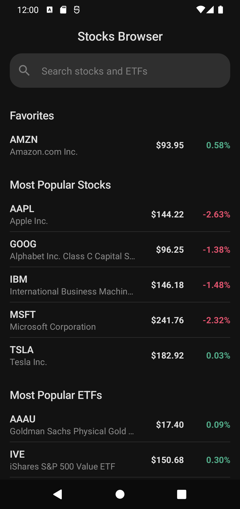
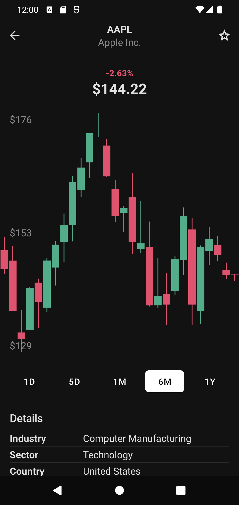
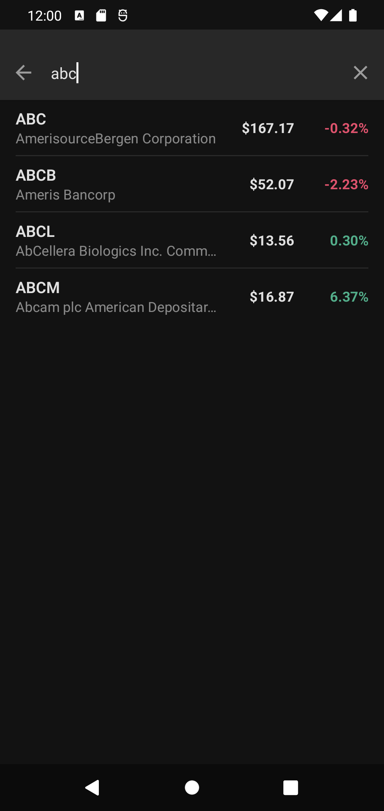
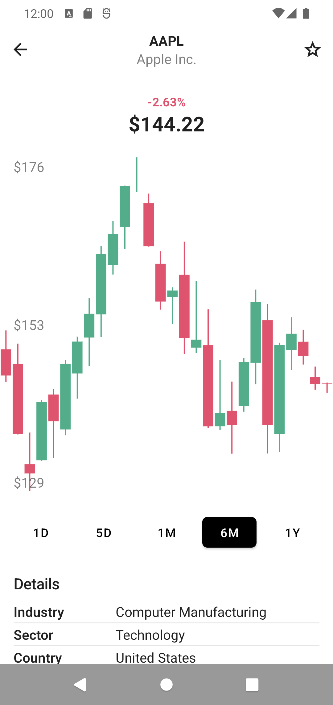
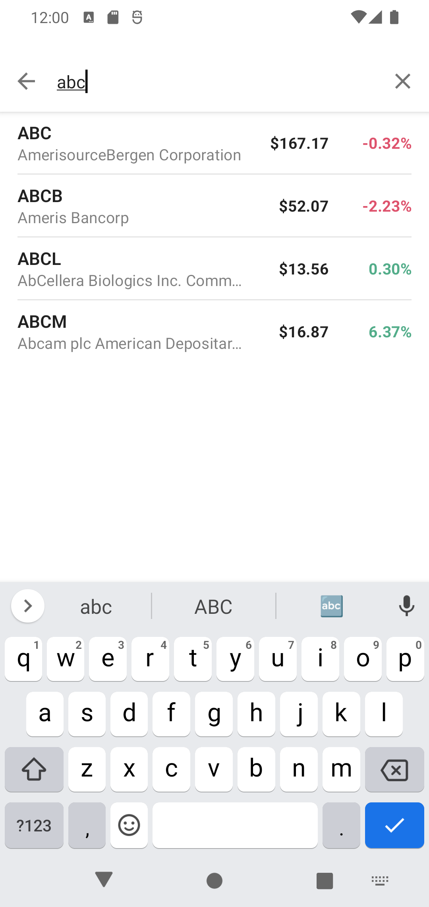

# Stock Browser - Android App

**DISCLAIMER**: Work in progress

This project demonstrates how to write a modern android app in 2023. The main goal was to make the app robust, testable, and maintainable using minimal set of well-known libraries and following best practices.

The app itself is very simple. It loads market data from multiple 3rd party APIs and stores them in a local database. Then it allows users to search, browse and mark favorite items.

## Architecture

Architecture follows principles of separation of concerns. App is divided into 3 main layers, every one with its own responsibilities.

- **UI Layer** displays application data on screen using Jetpack Compose. It also holds state of simple components as text fields or  
- **Domain Layer** is responsible for encapsulating complex business logic, or simple business logic that is reused by multiple ViewModels.
- **Data Layer** contains application data and business logic

TODO: write more about architecture

## Libraries

- [**Room**](https://developer.android.com/training/data-storage/room) - Abstraction layer over SQLite database
- [**Jetpack Compose**](https://developer.android.com/jetpack/compose) - Android’s recommended modern toolkit for building native UI
- [**Compose Navigation**](https://developer.android.com/jetpack/compose/navigation) - The Navigation component provides support for Jetpack Compose applications.
- [**DataStore**](https://developer.android.com/topic/libraries/architecture/datastore) - Solution that allows you to store key-value pairs or typed objects
- [**Retrofit 2**](https://square.github.io/retrofit/) - A type-safe HTTP client for Android and Java.
- [**kotlinx.serialization**](https://github.com/Kotlin/kotlinx.serialization) - Kotlin multiplatform / multi-format reflectionless serialization
- [**Hilt**](https://dagger.dev/hilt/) - Provides a standard way to incorporate Dagger dependency injection into an Android application.
- [**Orbit-MVI**](https://orbit-mvi.org/) - Redux/MVI-like library - but without the baggage

## Screenshots

|  |  |  |
| ------- | ----- | ----- |
|  |  |  |

## Video

| <video src="https://user-images.githubusercontent.com/2919625/204576896-42fe4817-75a2-489f-8405-8b6bd1b848ff.mp4" /> | <video src="https://user-images.githubusercontent.com/2919625/204577067-b5c1225e-7537-4c4d-bc78-31758cfdd591.mp4" /> |
| ----- | ----- |

